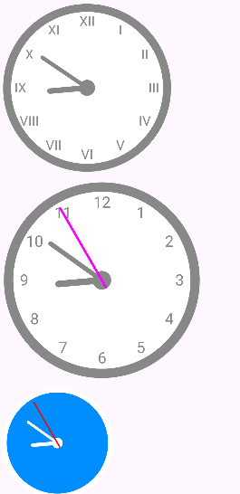

В приложении есть возможность легко добавлять компоненты через XML или программно, настраивать их внешний вид, обеспечивать точное отображение времени независимо от изменений, оптимизировать обновление элементов часов при изменении их внешнего вида, использовать привлекательный и минималистичный дизайн в стиле Material Design, а также рисовать элементы интерфейса с помощью Canvas.